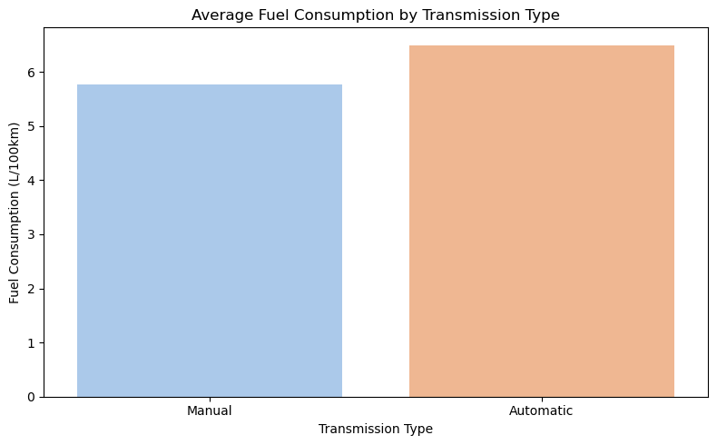
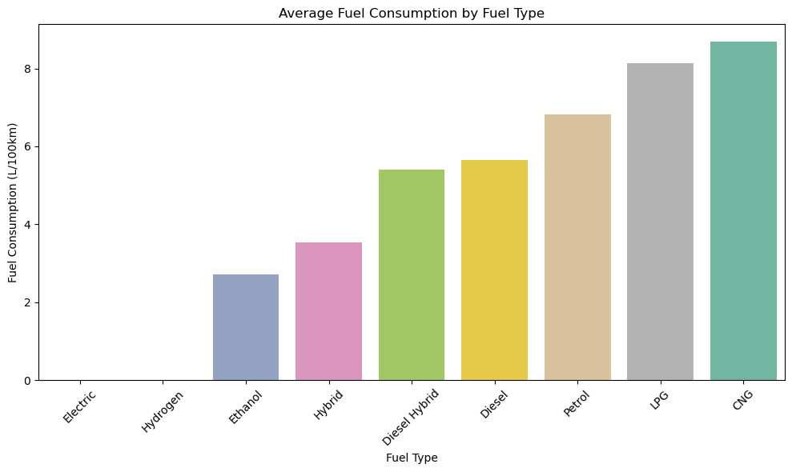
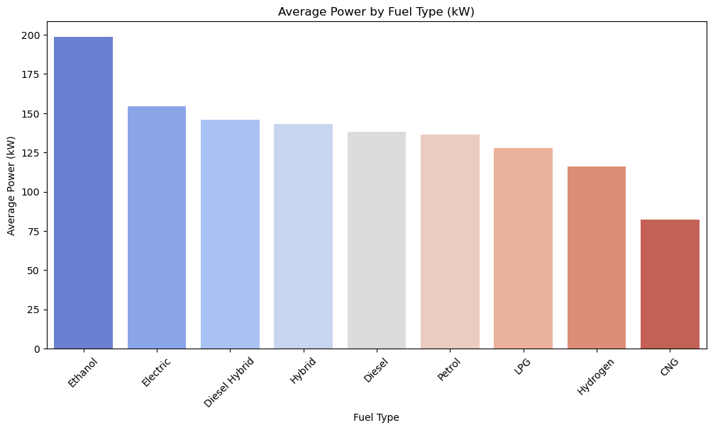
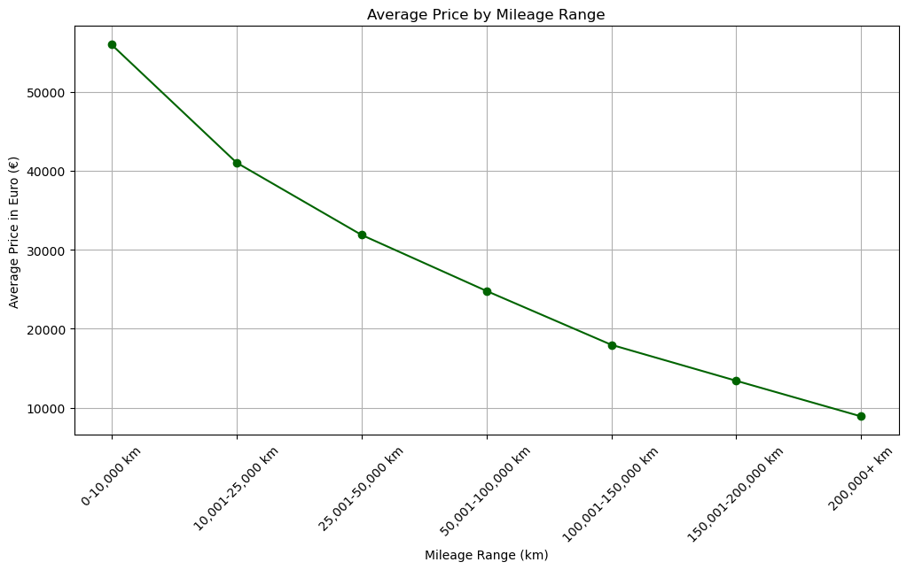
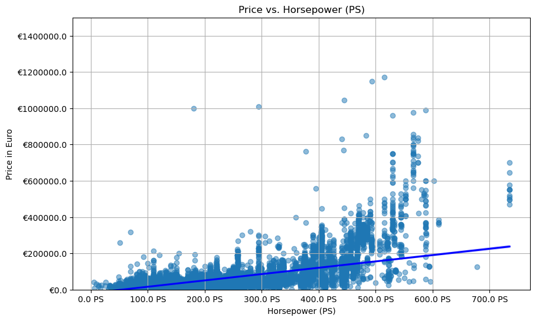

# German Car Purchase Data Analysis

This project analyzes trends in German car sales using a dataset from Kaggle. The goal is to uncover insights for consumers, dealerships, and manufacturers related to fuel efficiency, pricing, and performance.

## Questions Explored

- Do manual or automatic cars have better fuel economy?
- Which fuel types are most efficient and powerful?
- How does mileage impact car price?
- Is there a correlation between horsepower and price?

## Key Insights

- Manual cars are more fuel-efficient on average.
- Electric and ethanol-fueled cars offer high power and low fuel consumption.
- Cars with lower mileage are significantly more expensive.
- Horsepower and price show a strong positive correlation.

## Tools Used

- Python (`pandas`, `matplotlib`, `seaborn`)
- Jupyter Notebook
- Data from Kaggle: German Car Insights Dataset

## Files

- `Final_Project.ipynb`: Main analysis notebook with cleaning, EDA, and plots
- `gcar_data.csv`: Cleaned dataset
- `German Car Purchase Data Analysis.pptx`: Presentation slides
- `Summary of German Car Data Analysis.docx`: Written summary of findings
